# System Analysis and UML Diagrams
## Student Wallet Wise - Expense Tracker Application

---

## 6.1 Use Case Diagram

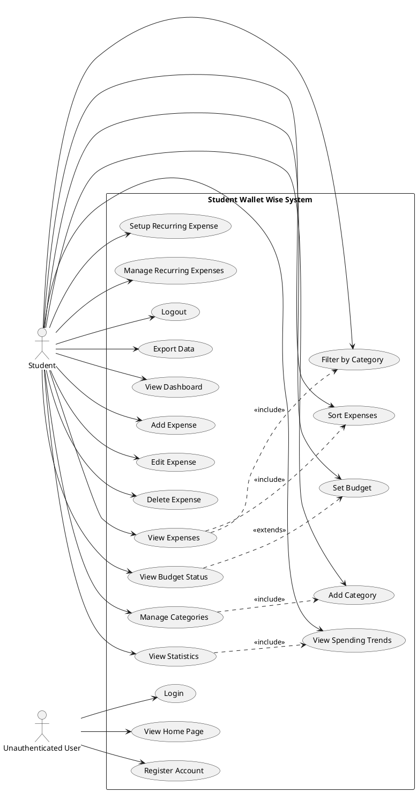

---

## 6.2 Class Diagram

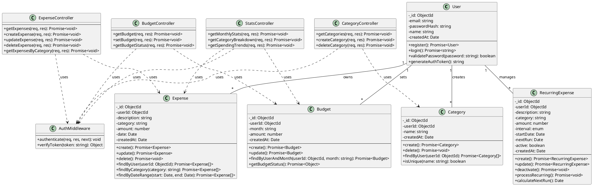

---

## 6.3 Sequence Diagram - User Registration

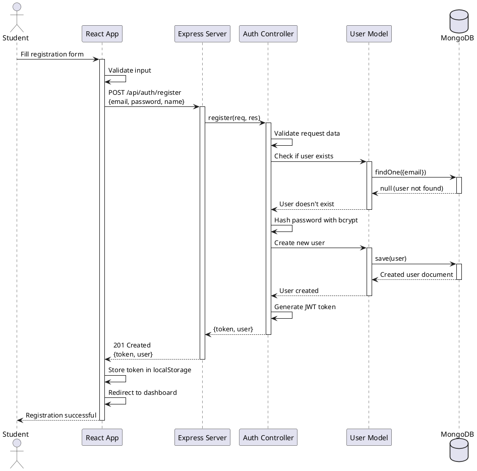

---

## 6.4 Sequence Diagram - Add Expense

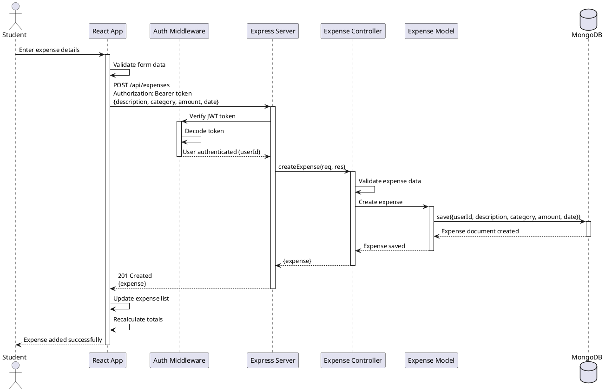

---

## 6.5 Sequence Diagram - View Budget Status

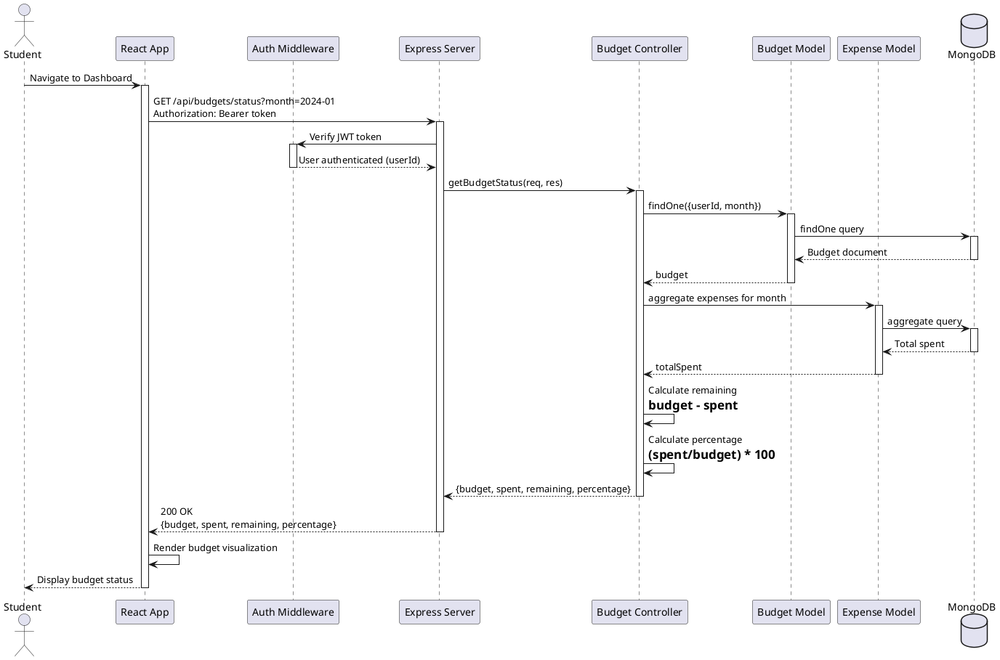

---

## 6.6 Activity Diagram - Expense Management Flow

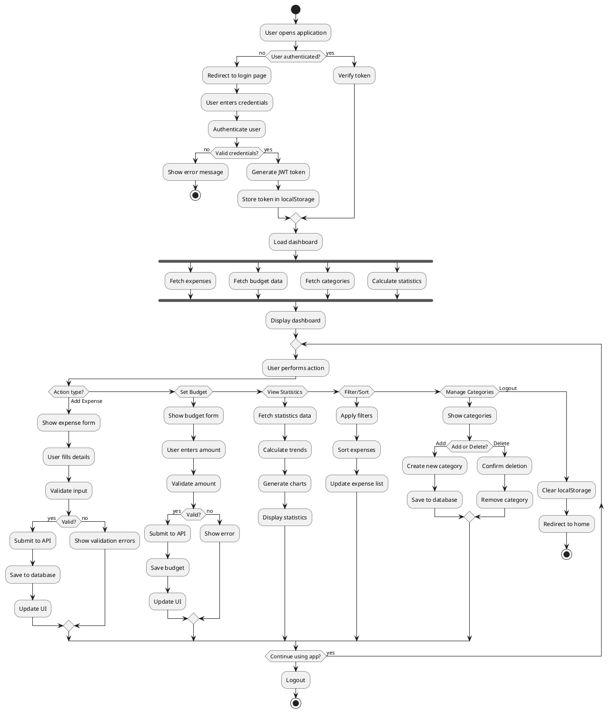

---

## 6.7 Component Diagram

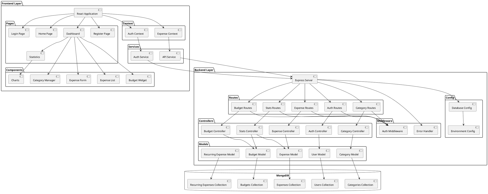

---

## 6.8 Deployment Diagram

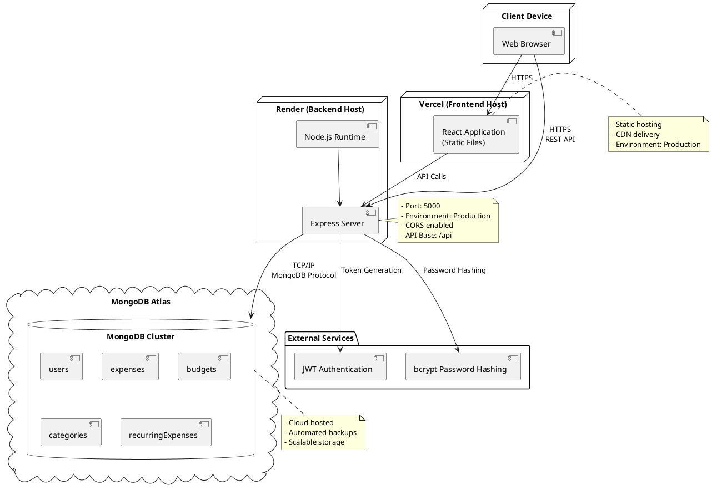

---

## 6.9 State Diagram - User Authentication State

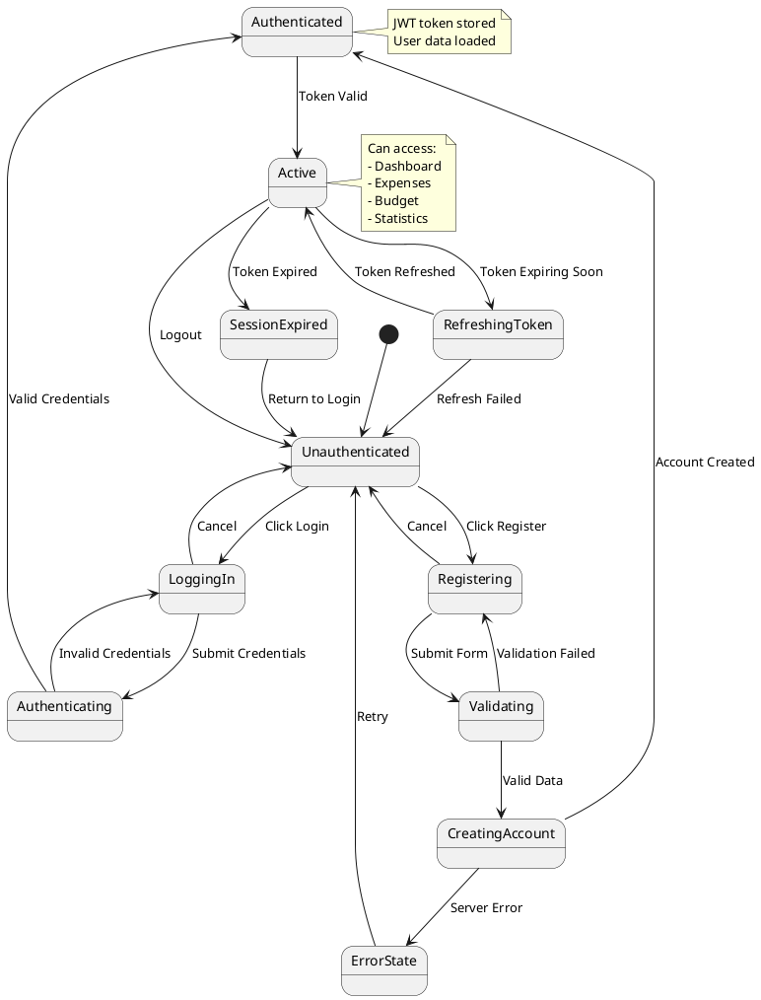

---

## 6.10 State Diagram - Expense Management State

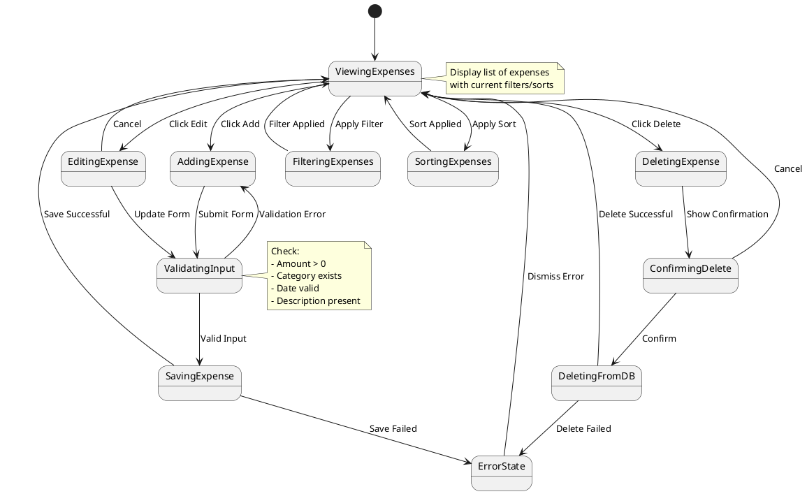

---

## 6.11 Entity Relationship Diagram

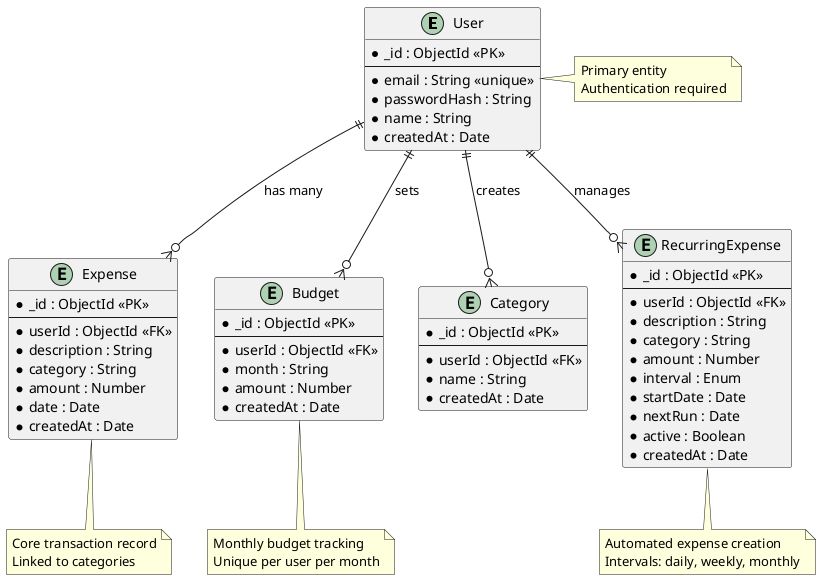

---

## System Architecture Overview

### 6.12 Technology Stack

**Frontend:**
- React 18 with TypeScript
- Vite as build tool
- Tailwind CSS for styling
- React Router for navigation
- Context API for state management
- Axios for API communication

**Backend:**
- Node.js with Express.js
- TypeScript for type safety
- MongoDB with Mongoose ODM
- JWT for authentication
- bcrypt for password hashing

**Deployment:**
- Frontend: Vercel
- Backend: Render
- Database: MongoDB Atlas

### 6.13 API Endpoints

**Authentication Endpoints:**
- POST `/api/auth/register` - Register new user
- POST `/api/auth/login` - Login user
- GET `/api/auth/me` - Get current user

**Expense Endpoints:**
- GET `/api/expenses` - Get all expenses (filtered, sorted)
- POST `/api/expenses` - Create new expense
- PUT `/api/expenses/:id` - Update expense
- DELETE `/api/expenses/:id` - Delete expense

**Budget Endpoints:**
- GET `/api/budgets` - Get budget for month
- POST `/api/budgets` - Set budget
- GET `/api/budgets/status` - Get budget status with spending

**Category Endpoints:**
- GET `/api/categories` - Get all categories
- POST `/api/categories` - Create category
- DELETE `/api/categories/:id` - Delete category

**Statistics Endpoints:**
- GET `/api/stats/monthly` - Get monthly statistics
- GET `/api/stats/category` - Get category breakdown
- GET `/api/stats/trends` - Get spending trends

**Recurring Expense Endpoints:**
- GET `/api/recurring` - Get all recurring expenses
- POST `/api/recurring` - Create recurring expense
- PUT `/api/recurring/:id` - Update recurring expense
- DELETE `/api/recurring/:id` - Delete recurring expense

---

## 6.14 Security Measures

1. **Authentication**: JWT-based authentication with secure token storage
2. **Password Security**: bcrypt hashing with salt rounds
3. **Authorization**: Middleware to verify user access to resources
4. **Input Validation**: Server-side validation for all inputs
5. **CORS**: Configured CORS for cross-origin requests
6. **Environment Variables**: Sensitive data stored in environment variables
7. **HTTPS**: Secure communication in production
8. **Database Security**: MongoDB connection with authentication

---

## 6.15 Database Indexes

```javascript
// User Collection
{ email: 1 } // Unique index for fast login lookup

// Expense Collection
{ userId: 1, date: -1 } // Compound index for user expenses sorted by date

// Budget Collection
{ userId: 1, month: 1 } // Unique compound index

// Category Collection
{ userId: 1, name: 1 } // Unique compound index

// RecurringExpense Collection
{ userId: 1, active: 1 } // Index for active recurring expenses
```

---

## Notes

To visualize these PlantUML diagrams:
1. Use online tools like PlantText (www.planttext.com)
2. Use VS Code with PlantUML extension
3. Use IntelliJ IDEA with PlantUML plugin
4. Use command-line PlantUML with Java

Each diagram provides a different perspective of the Student Wallet Wise system, helping understand the architecture, data flow, user interactions, and system components.
